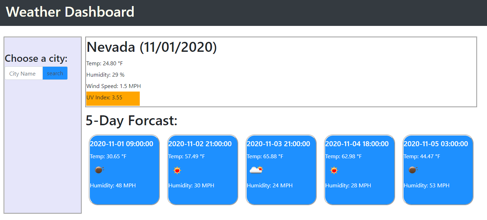

# HW7-Weather-Dashboard

This application is for any  traveler to see the weather outlook for multiple cities, and to plan a trip accordingly!

The API used to retrieve weather data for cities is: (https://openweathermap.org/api) 

The application link: https://decoste.github.io/HW7-Weather-Dashboard/

The following image demonstrates the application functionality:

